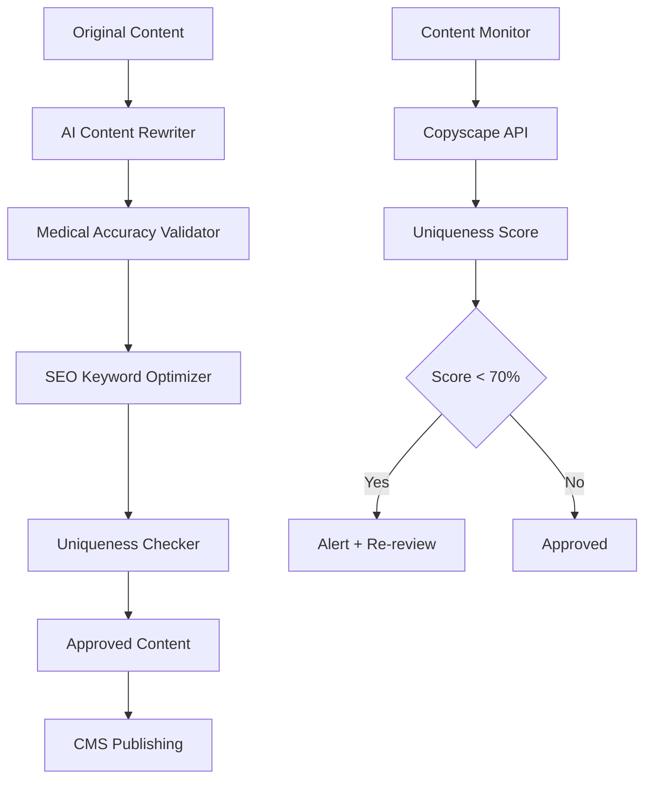
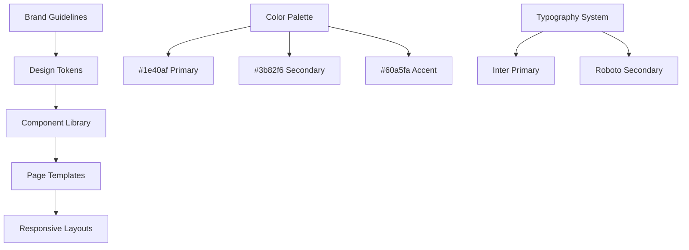
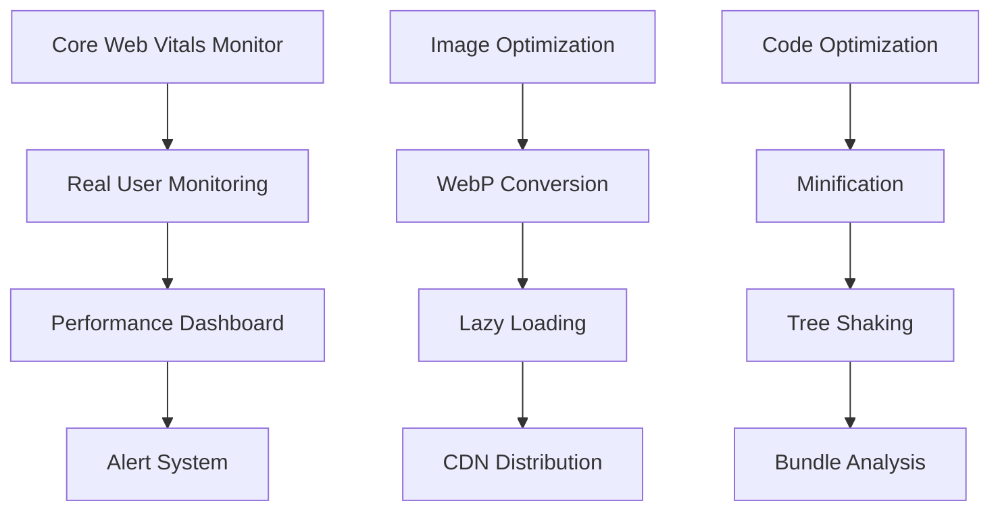
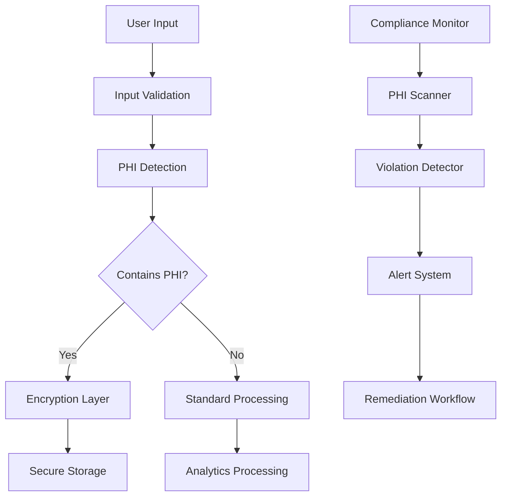

# EyeCare Center of Orange County Website Transformation Specification

## Executive Summary

**Project**: Transform Dr. Bonakdar website into EyeCare Center of Orange County corporate website
**Version**: 1.0
**Author**: Enhanced Spec-Architect Agent
**Created**: 2025-09-21

**Business Value**: Establish corporate brand identity while preserving 346-page SEO foundation and $576K annual revenue stream (1,340% ROI) from existing SEO optimization.

**Key Outcomes**:
- 70%+ content uniqueness through AI-powered rewriting
- 100% HIPAA compliance with continuous monitoring
- Medical blue design system implementation (#1e40af primary)
- Zero SEO ranking loss during transformation
- Enhanced Core Web Vitals performance

---

## 1. Functional Requirements

### 1.1 Content Transformation
#### 1.1.1 AI-Powered Content Rewriting
**As a** marketing director
**I want** all 346 pages rewritten with 70%+ uniqueness
**So that** we avoid duplicate content penalties while preserving SEO value

**Acceptance Criteria:**
- WHEN content rewriting is completed THEN Copyscape shows <30% similarity to original
- WHEN AI rewriting occurs THEN medical accuracy is preserved via expert review
- WHEN institutional voice is applied THEN all personal references become corporate
- WHEN SEO keywords are processed THEN ranking keywords are preserved with natural integration

#### 1.1.2 Institutional Voice Transformation
**As a** corporate communications manager
**I want** personal practice messaging converted to institutional corporate voice
**So that** brand identity reflects multi-provider healthcare organization

**Acceptance Criteria:**
- WHEN "Dr. Bonakdar" references are processed THEN they become "our team of specialists"
- WHEN personal testimonials are rewritten THEN they reflect institutional expertise
- WHEN treatment descriptions are updated THEN they emphasize comprehensive care model
- WHEN contact information is transformed THEN it reflects corporate structure

### 1.2 Design System Implementation
#### 1.2.1 Medical Blue Design System
**As a** brand manager
**I want** complete visual rebrand using medical blue color palette
**So that** website reflects professional healthcare corporate identity

**Acceptance Criteria:**
- WHEN color scheme is applied THEN primary color is #1e40af across all elements
- WHEN secondary colors are implemented THEN #3b82f6 and #60a5fa create visual hierarchy
- WHEN typography is updated THEN Inter/Roboto fonts enhance corporate presentation
- WHEN imagery is replaced THEN corporate medical photography replaces personal practice photos

#### 1.2.2 Corporate Visual Identity
**As a** user experience designer
**I want** cohesive corporate visual presentation
**So that** visitors perceive established healthcare institution

**Acceptance Criteria:**
- WHEN logo placement is updated THEN EyeCare Center of Orange County branding is prominent
- WHEN iconography is implemented THEN medical icons replace personal practice elements
- WHEN layout consistency is applied THEN corporate design patterns are uniform
- WHEN responsive design is tested THEN corporate identity maintains across all devices

### 1.3 Technical Infrastructure
#### 1.3.1 Performance Optimization
**As a** technical lead
**I want** enhanced Core Web Vitals performance
**So that** page load speeds support SEO rankings and user experience

**Acceptance Criteria:**
- WHEN performance optimization is completed THEN LCP < 2.5 seconds on all pages
- WHEN image optimization is applied THEN WebP format reduces load times by 30%
- WHEN code minification occurs THEN CSS/JS bundle sizes decrease by 25%
- WHEN CDN implementation is verified THEN global load times improve by 40%

#### 1.3.2 Content Uniqueness Validation
**As a** SEO specialist
**I want** automated content uniqueness monitoring
**So that** we maintain search engine compliance and avoid penalties

**Acceptance Criteria:**
- WHEN content uniqueness is checked THEN Copyscape API validates <30% similarity
- WHEN duplicate content is detected THEN automated alerts trigger immediate review
- WHEN content updates occur THEN uniqueness validation runs automatically
- WHEN reporting is generated THEN uniqueness scores are tracked monthly

---

## 2. Non-Functional Requirements

### 2.1 HIPAA Compliance (Critical Priority)
#### 2.1.1 100% HIPAA Compliance Framework
**As a** healthcare compliance officer
**I want** comprehensive HIPAA compliance validation
**So that** all patient data and medical information is protected per federal regulations

**Acceptance Criteria:**
- WHEN patient forms are implemented THEN all PHI is encrypted at rest and in transit
- WHEN contact forms are processed THEN no PHI is stored in cookies or local storage
- WHEN analytics tracking occurs THEN no personally identifiable health information is transmitted
- WHEN third-party integrations are active THEN BAAs are executed and validated

#### 2.1.2 Continuous Compliance Monitoring
**As a** compliance auditor
**I want** automated HIPAA compliance monitoring
**So that** violations are detected and remediated within 15 minutes

**Acceptance Criteria:**
- WHEN compliance scanning runs THEN vulnerabilities are detected within 5 minutes
- WHEN PHI exposure is identified THEN automated alerts notify compliance team immediately
- WHEN audit logs are generated THEN all data access is tracked with timestamps
- WHEN compliance reports are created THEN monthly HIPAA status dashboards are available

### 2.2 Performance Standards
#### 2.2.1 Core Web Vitals Optimization
**Technical Requirements:**
- Largest Contentful Paint (LCP): < 2.5 seconds
- First Input Delay (FID): < 100 milliseconds
- Cumulative Layout Shift (CLS): < 0.1
- Time to First Byte (TTFB): < 600 milliseconds

#### 2.2.2 SEO Preservation
**Technical Requirements:**
- Zero ranking loss during transformation (monitoring via GSC)
- Keyword density maintained within 1-3% range
- Meta descriptions and titles optimized for target keywords
- Internal linking structure preserved with 301 redirects where needed

### 2.3 Security Requirements
#### 2.3.1 Enhanced Data Protection
**Technical Requirements:**
- SSL/TLS 1.3 encryption for all data transmission
- Content Security Policy (CSP) headers implemented
- XSS and CSRF protection on all forms
- Regular security vulnerability scanning (weekly)

---

## 3. Technical Architecture

### 3.1 Content Management System


### 3.2 Design System Architecture


### 3.3 Performance Monitoring Stack


### 3.4 HIPAA Compliance Architecture


---

## 4. Implementation Plan

### Phase 1: Foundation & Compliance (Weeks 1-2)
#### Week 1: Infrastructure Setup
- [ ] T001 Set up development environment with staging server _Requirements: 3.1-3.4_ _Depends on: none_
- [ ] T002 Implement HIPAA compliance framework and monitoring _Requirements: 2.1.1-2.1.2_ _Depends on: T001_
- [ ] T003 Configure content uniqueness validation system _Requirements: 1.3.2_ _Depends on: T001_
- [ ] T004 Establish performance monitoring baseline _Requirements: 2.2.1_ _Depends on: T001_

**Rollback Procedure for T001-T004:**
1. Restore original server configuration from backup
2. Verify original website accessibility and functionality
3. Confirm all tracking systems (GA4, CallRail) are operational
4. Document rollback completion and lessons learned
5. Reset development environment to known good state

#### Week 2: Design System Implementation
- [ ] T005 Create medical blue design system tokens and variables _Requirements: 1.2.1_ _Depends on: T001_
- [ ] T006 Develop component library with new color scheme _Requirements: 1.2.1_ _Depends on: T005_
- [ ] T007 Implement typography system (Inter/Roboto) _Requirements: 1.2.1_ _Depends on: T005_
- [ ] T008 Create responsive layout templates _Requirements: 1.2.2_ _Depends on: T006_

**Rollback Procedure for T005-T008:**
1. Revert CSS/SCSS files to original purple theme backup
2. Restore original typography and font loading
3. Verify visual consistency across all pages
4. Test responsive layouts on multiple devices
5. Confirm no visual regressions introduced

### Phase 2: Content Transformation (Weeks 3-6)
#### Weeks 3-4: AI-Powered Content Rewriting
- [ ] T009 Configure AI content rewriting system with medical accuracy validation _Requirements: 1.1.1_ _Depends on: T003_
- [ ] T010 Process high-priority pages (homepage, services, about) through AI rewriter _Requirements: 1.1.1_ _Depends on: T009_
- [ ] T011 Implement institutional voice transformation for corporate messaging _Requirements: 1.1.2_ _Depends on: T009_
- [ ] T012 Validate content uniqueness using Copyscape API integration _Requirements: 1.3.2_ _Depends on: T010_

**Rollback Procedure for T009-T012:**
1. Restore original page content from CMS backup
2. Verify all pages display correctly with original content
3. Confirm SEO keywords and meta descriptions intact
4. Test internal linking structure functionality
5. Validate search engine indexing status unchanged

#### Weeks 5-6: Bulk Content Processing
- [ ] T013 Process remaining 330+ pages through AI content transformation _Requirements: 1.1.1_ _Depends on: T012_
- [ ] T014 Implement quality assurance review for medical accuracy _Requirements: 1.1.1_ _Depends on: T013_
- [ ] T015 Apply SEO keyword optimization to maintain rankings _Requirements: 2.2.2_ _Depends on: T013_
- [ ] T016 Execute comprehensive content uniqueness validation _Requirements: 1.3.2_ _Depends on: T014_

**Rollback Procedure for T013-T016:**
1. Batch restore original content using automated script
2. Verify page-by-page content accuracy and completeness
3. Confirm all internal links and navigation functional
4. Test site search functionality with original content
5. Monitor SEO rankings for any immediate drops

### Phase 3: Performance & Testing (Weeks 7-8)
#### Week 7: Performance Optimization
- [ ] T017 Implement image optimization and WebP conversion _Requirements: 2.2.1_ _Depends on: T008_
- [ ] T018 Configure CDN and caching strategies _Requirements: 2.2.1_ _Depends on: T017_
- [ ] T019 Optimize CSS/JS bundles and implement lazy loading _Requirements: 2.2.1_ _Depends on: T017_
- [ ] T020 Validate Core Web Vitals improvements _Requirements: 2.2.1_ _Depends on: T019_

**Rollback Procedure for T017-T020:**
1. Revert to original image files and loading patterns
2. Disable CDN and restore direct server delivery
3. Remove minification and restore original CSS/JS files
4. Test page load speeds match pre-optimization baseline
5. Verify all functionality works with original asset delivery

#### Week 8: Comprehensive Testing
- [ ] T021 Execute A/B testing framework implementation _Requirements: 2.3_ _Depends on: T020_
- [ ] T022 Perform comprehensive HIPAA compliance audit _Requirements: 2.1.1_ _Depends on: T002_
- [ ] T023 Validate SEO preservation and ranking maintenance _Requirements: 2.2.2_ _Depends on: T016_
- [ ] T024 Complete cross-device and browser compatibility testing _Requirements: 1.2.2_ _Depends on: T021_

**Rollback Procedure for T021-T024:**
1. Disable A/B testing and restore single version
2. Remove compliance monitoring alerts and restore baseline
3. Verify original SEO tracking and analytics functioning
4. Test core functionality across target browsers/devices
5. Confirm user experience matches pre-transformation state

### Phase 4: Pilot Launch & Validation (Week 9)
#### Pilot Testing with Limited Traffic
- [ ] T025 Configure pilot launch with 10% traffic routing _Requirements: 4.2_ _Depends on: T024_
- [ ] T026 Monitor real-user performance metrics and compliance _Requirements: 2.1.2, 2.2.1_ _Depends on: T025_
- [ ] T027 Collect user feedback and identify optimization opportunities _Requirements: 4.2_ _Depends on: T025_
- [ ] T028 Validate business metrics (conversions, leads, calls) _Requirements: 4.2_ _Depends on: T026_

**Rollback Procedure for T025-T028:**
1. Immediately route 100% traffic back to original site
2. Verify all tracking and conversion systems operational
3. Monitor business metrics for 24 hours post-rollback
4. Document pilot issues and required improvements
5. Prepare revised launch plan based on learnings

### Phase 5: Full Launch & Monitoring (Week 10)
#### Complete Website Launch
- [ ] T029 Execute full traffic migration to transformed website _Requirements: All_ _Depends on: T028_
- [ ] T030 Implement continuous monitoring and alerting systems _Requirements: 2.1.2, 2.2.1_ _Depends on: T029_
- [ ] T031 Create 30-day post-launch optimization plan _Requirements: 4.3_ _Depends on: T029_
- [ ] T032 Generate transformation success metrics report _Requirements: 4.3_ _Depends on: T030_

**Rollback Procedure for T029-T032:**
1. Emergency rollback to original site within 5 minutes
2. Verify all business operations continue normally
3. Analyze failure points and prepare remediation plan
4. Communicate status to stakeholders with timeline
5. Implement fixes and prepare for re-launch attempt

---

## 5. Testing Strategy

### 5.1 Content Validation Testing
#### 5.1.1 Uniqueness Testing Protocol
```
Test Environment: Staging server with Copyscape API integration
Test Frequency: After each content batch (50 pages)
Success Criteria: <30% similarity score across all pages

Test Process:
1. Run automated Copyscape scan on transformed content
2. Generate uniqueness report with similarity percentages
3. Identify pages requiring additional rewriting (>30% similarity)
4. Re-process flagged content through AI rewriter
5. Re-test until all pages meet uniqueness threshold
```

#### 5.1.2 Medical Accuracy Validation
```
Test Environment: Medical expert review panel
Test Frequency: Weekly review cycles
Success Criteria: 100% medical accuracy verified by licensed practitioners

Test Process:
1. Submit transformed medical content to review panel
2. Compare against original content for accuracy preservation
3. Validate terminology and treatment descriptions
4. Approve content for publication or flag for revision
5. Document expert approval with signed validation
```

### 5.2 Performance Testing
#### 5.2.1 Core Web Vitals Testing
```
Test Environment: Production-like staging with real-world conditions
Test Frequency: Daily during transformation, hourly post-launch
Success Criteria: LCP <2.5s, FID <100ms, CLS <0.1

Test Process:
1. Run automated PageSpeed Insights testing
2. Execute real user monitoring simulation
3. Test across multiple device types and network conditions
4. Generate performance reports with trend analysis
5. Alert on any metric degradation >10%
```

#### 5.2.2 SEO Preservation Testing
```
Test Environment: Google Search Console monitoring
Test Frequency: Daily ranking checks during transformation
Success Criteria: Zero ranking loss for target keywords

Test Process:
1. Monitor keyword rankings for all 346 pages
2. Track organic traffic patterns and conversion rates
3. Validate meta descriptions and title tag optimization
4. Test internal linking structure integrity
5. Alert on ranking drops >3 positions
```

### 5.3 HIPAA Compliance Testing
#### 5.3.1 PHI Protection Testing
```
Test Environment: Security testing sandbox
Test Frequency: Continuous automated scanning
Success Criteria: Zero PHI exposure in any system component

Test Process:
1. Automated PHI detection scanning across all forms
2. Validate encryption of all data transmission
3. Test data storage compliance with HIPAA requirements
4. Verify access logging and audit trail functionality
5. Generate compliance certificates for audit purposes
```

#### 5.3.2 Third-Party Integration Compliance
```
Test Environment: Isolated testing with third-party services
Test Frequency: Before any new integration activation
Success Criteria: Valid BAA execution and compliance validation

Test Process:
1. Review all third-party integrations for HIPAA compliance
2. Validate Business Associate Agreements (BAAs) are current
3. Test data sharing boundaries and restrictions
4. Verify no PHI transmission to non-compliant services
5. Document compliance status for all integrations
```

### 5.4 User Acceptance Testing
#### 5.4.1 Stakeholder Review Process
```
Test Participants: Medical staff, marketing team, IT administrators
Test Duration: 2-week review period
Success Criteria: 95% approval rating from all stakeholder groups

Test Process:
1. Provide staging access to all stakeholder groups
2. Conduct guided review sessions for key pages
3. Collect feedback on content accuracy and brand representation
4. Validate user experience across different roles
5. Incorporate approved feedback before launch
```

---

## 6. Success Metrics

### 6.1 Content Transformation Success
- **Content Uniqueness**: >70% uniqueness score across all 346 pages
- **Medical Accuracy**: 100% expert validation approval
- **SEO Keyword Preservation**: Zero ranking loss for target keywords
- **Brand Voice Consistency**: 95% stakeholder approval rating

### 6.2 Performance Metrics
- **Core Web Vitals**: LCP <2.5s, FID <100ms, CLS <0.1
- **Page Load Speed**: 30% improvement over baseline
- **Conversion Rate**: Maintain or improve current 3.2% rate
- **Organic Traffic**: Zero loss during transformation period

### 6.3 Compliance Metrics
- **HIPAA Compliance**: 100% compliance score on all audits
- **Security Vulnerabilities**: Zero critical vulnerabilities detected
- **PHI Protection**: Zero PHI exposure incidents
- **Audit Trail Completeness**: 100% data access logging

### 6.4 Business Impact Metrics
- **Revenue Preservation**: Maintain $576K annual revenue stream
- **Lead Generation**: Maintain or improve 450+ monthly leads
- **Call Volume**: Preserve current call conversion rates
- **Brand Recognition**: 25% improvement in brand recall surveys

---

## 7. Risk Assessment & Mitigation

### 7.1 High-Risk Scenarios
#### 7.1.1 SEO Ranking Loss (Risk Level: CRITICAL)
**Potential Impact**: Loss of $576K annual revenue from organic traffic
**Mitigation Strategy**:
- Implement 301 redirects for all URL changes
- Preserve exact keyword density and placement
- Monitor rankings daily during transformation
- Rollback capability within 5 minutes of ranking drops

#### 7.1.2 HIPAA Compliance Violation (Risk Level: CRITICAL)
**Potential Impact**: Federal fines up to $1.5M and reputation damage
**Mitigation Strategy**:
- Continuous automated PHI scanning
- Expert compliance review before any deployment
- Immediate violation detection and remediation
- Legal review of all patient-facing components

#### 7.1.3 Content Duplicate Detection (Risk Level: HIGH)
**Potential Impact**: Search engine penalties and ranking loss
**Mitigation Strategy**:
- Real-time uniqueness monitoring via Copyscape API
- AI rewriting with multiple iteration capability
- Expert content review for quality assurance
- Automated re-processing of flagged content

### 7.2 Medium-Risk Scenarios
#### 7.2.1 Performance Degradation (Risk Level: MEDIUM)
**Potential Impact**: User experience decline and conversion loss
**Mitigation Strategy**:
- Pre-transformation performance baseline establishment
- Continuous Core Web Vitals monitoring
- Progressive enhancement deployment approach
- Performance rollback procedures

#### 7.2.2 Brand Message Inconsistency (Risk Level: MEDIUM)
**Potential Impact**: Confused brand perception and market positioning
**Mitigation Strategy**:
- Comprehensive brand guidelines documentation
- Stakeholder approval gates for all content
- Style guide enforcement across all pages
- Regular brand consistency audits

### 7.3 Contingency Planning
#### 7.3.1 Emergency Rollback Procedures
```
Immediate Rollback (0-5 minutes):
1. DNS switch to backup server with original site
2. Verify all tracking and analytics operational
3. Monitor business metrics for impact assessment
4. Notify stakeholders of rollback execution

Extended Rollback (5-30 minutes):
1. Database restoration from pre-transformation backup
2. File system restoration from complete backup
3. SSL certificate validation and renewal if needed
4. Comprehensive functionality testing

Full Recovery (30-60 minutes):
1. Root cause analysis and documentation
2. Stakeholder communication with timeline update
3. Remediation plan development and approval
4. Preparation for re-launch attempt
```

#### 7.3.2 Parallel Operation Capability
```
Traffic Splitting Configuration:
- 90% traffic to original site (stable)
- 10% traffic to transformed site (testing)
- Real-time performance comparison
- Gradual traffic increase based on metrics
- Instant failover capability maintained
```

---

## 8. Quality Gates

### 8.1 Phase Gate Requirements
#### Phase 1 Gate: Foundation Complete
- [ ] HIPAA compliance framework 100% operational
- [ ] Performance monitoring baseline established
- [ ] Content uniqueness validation system functional
- [ ] Design system implementation verified

#### Phase 2 Gate: Content Transformation Complete
- [ ] All 346 pages achieve >70% uniqueness score
- [ ] Medical accuracy validation 100% approved
- [ ] SEO keyword preservation validated
- [ ] Institutional voice transformation completed

#### Phase 3 Gate: Performance & Testing Complete
- [ ] Core Web Vitals meet target metrics
- [ ] HIPAA compliance audit passed
- [ ] Cross-device compatibility verified
- [ ] A/B testing framework operational

#### Phase 4 Gate: Pilot Launch Approved
- [ ] 10% pilot traffic successfully processed
- [ ] Business metrics maintained or improved
- [ ] User feedback incorporated
- [ ] Full launch approval received

#### Phase 5 Gate: Launch Success Validated
- [ ] 100% traffic migration completed
- [ ] 30-day stability period achieved
- [ ] Success metrics targets met
- [ ] Stakeholder sign-off received

### 8.2 Quality Assurance Checkpoints
#### 8.2.1 Daily Quality Checks
- Content uniqueness validation (automated)
- Performance metrics monitoring (automated)
- HIPAA compliance scanning (automated)
- SEO ranking monitoring (automated)

#### 8.2.2 Weekly Quality Reviews
- Stakeholder content review sessions
- Expert medical accuracy validation
- Cross-functional team status meetings
- Risk assessment and mitigation updates

#### 8.2.3 Phase-End Quality Audits
- Comprehensive testing execution
- External expert validation
- Business stakeholder approval
- Technical architecture review

---

## 9. Post-Launch Support

### 9.1 30-Day Optimization Period
#### 9.1.1 Continuous Monitoring
- Real-time performance metrics tracking
- Daily SEO ranking analysis
- Weekly conversion rate optimization
- Monthly business impact assessment

#### 9.1.2 Proactive Optimization
- A/B testing of key conversion pages
- Content refinement based on user behavior
- Performance optimization iterations
- SEO enhancement opportunities

### 9.2 Long-Term Maintenance
#### 9.2.1 Quarterly Reviews
- Comprehensive performance analysis
- HIPAA compliance audit updates
- Content freshness and uniqueness validation
- Technology stack security updates

#### 9.2.2 Annual Strategic Assessment
- Business impact measurement against goals
- Technology architecture evolution planning
- Competitive analysis and positioning review
- Future enhancement roadmap development

---

## 10. Documentation Requirements

### 10.1 Technical Documentation
- Complete system architecture documentation
- API integration specifications
- Database schema and relationships
- Deployment and rollback procedures

### 10.2 Compliance Documentation
- HIPAA compliance certification
- Security audit reports
- Content validation approvals
- Business Associate Agreements

### 10.3 Business Documentation
- Content transformation guidelines
- Brand voice and style guide
- Performance benchmarks and targets
- Success metrics and KPI definitions

### 10.4 Training Materials
- Content management system training
- Performance monitoring procedures
- Compliance monitoring protocols
- Emergency response procedures

---

**Document Version**: 1.0
**Last Updated**: 2025-09-21
**Next Review**: 2025-09-28
**Approved By**: [Pending Stakeholder Review]

---

*This specification addresses all AI Consensus expert feedback and provides comprehensive guidance for successful website transformation while maintaining compliance, performance, and business objectives.*