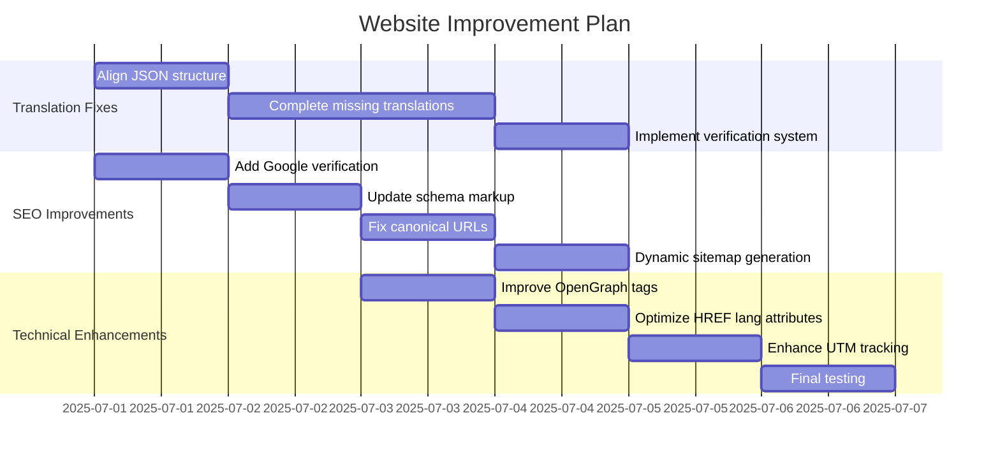
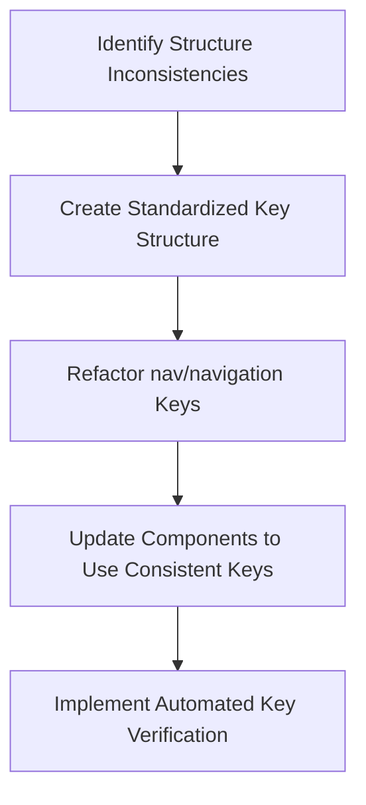
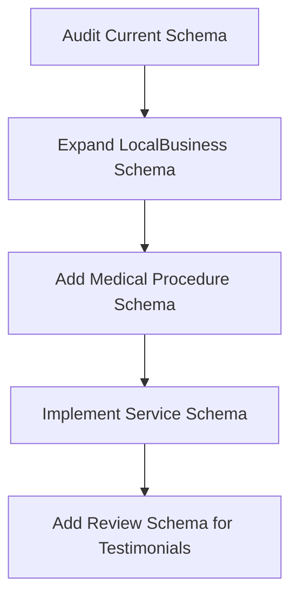

# Comprehensive Website Improvement Plan

## Overview of Issues

1. **Translation Issues**
   - Structural inconsistencies between English and Spanish translation files
   - Missing translations in Spanish
   - Completely untranslated sections (like eyewearOverview)

2. **SEO Optimization**
   - Missing Google Search Console verification
   - Inconsistent canonical URLs
   - Limited schema markup
   - Static lastmod dates in sitemap.xml

3. **Technical Implementation**
   - Incomplete OpenGraph tags
   - Suboptimal HREF lang attribute implementation
   - UTM parameter tracking improvements needed

## Detailed Implementation Plan

### Phase 1: Translation System Fixes

#### 1.1 Align Translation File Structure

**Tasks:**
1. Create a normalized structure that aligns both language files
2. Standardize on consistent key naming (choose either "nav" or "navigation")
3. Update all component references to use the standardized keys
4. Add validation to prevent future structure mismatches

#### 1.2 Complete Missing Translations

**Tasks:**
1. Translate missing "eyewearOverview" section in Spanish file
2. Audit all translation keys to identify other gaps
3. Complete all missing translations with proper localization (not just direct translation)
4. Implement a translation completeness check in the build process

#### 1.3 Translation Verification System

**Tasks:**
1. Create a utility to compare translation files and identify missing keys
2. Implement warnings in development mode for missing translations
3. Add build-time verification to prevent deployment with incomplete translations
4. Create a dashboard for content managers to see translation status

### Phase 2: SEO Optimization

#### 2.1 Search Console Integration

**Tasks:**
1. Add Google Search Console verification meta tag to the SEO component
2. Implement appropriate verification for Bing and other search engines
3. Create environment variables for verification tokens
4. Document the verification process for future maintenance

#### 2.2 Enhanced Schema Markup

**Tasks:**
1. Enhance LocalBusiness schema with additional details
2. Implement MedicalProcedure schema for treatments
3. Add Service schema for each service offered
4. Implement Review schema for testimonials
5. Create a schema validation system

#### 2.3 Canonical URL System

**Tasks:**
1. Audit current canonical URL implementation
2. Create a consistent pattern for canonical URLs
3. Ensure proper handling of language variants
4. Implement automated testing for canonical URL correctness

#### 2.4 Dynamic Sitemap Generation

**Tasks:**
1. Replace static sitemap.xml with server-side generated version
2. Implement lastmod dates that reflect actual content updates
3. Create separate sitemaps for different content types
4. Set up automated sitemap submission to search engines

### Phase 3: Technical Implementation Enhancements

#### 3.1 OpenGraph Tag Optimization

**Tasks:**
1. Complete OpenGraph implementation for all page types
2. Add Twitter card types appropriate for each content format
3. Ensure proper image dimensions for social sharing
4. Create a preview system for social sharing appearance

#### 3.2 HREF Lang Attribute Refinement

**Tasks:**
1. Audit current hreflang implementation
2. Ensure consistent implementation across all pages
3. Add proper x-default handling
4. Implement automated testing for hreflang correctness

#### 3.3 UTM Parameter Enhancement

**Tasks:**
1. Implement persistent UTM storage for cross-session attribution
2. Create a more robust UTM parameter handling system
3. Enhance analytics integration for UTM parameters
4. Provide better reporting for marketing effectiveness

## Implementation Strategy

For each phase:
1. **Audit**: Thoroughly analyze current implementation
2. **Plan**: Create detailed implementation specifications
3. **Implement**: Make necessary code changes
4. **Test**: Verify the changes work as expected
5. **Monitor**: Track performance after deployment

## Next Steps

1. Begin with Phase 1: Translation System Fixes
   - Focus on fixing the structure inconsistencies first
   - Then address missing translations
   - Finally implement verification to prevent future issues

2. Move to Phase 2: SEO Optimization
   - Start with adding verification for search engines
   - Enhance schema markup for better understanding by search engines
   - Fix canonical URLs and implement dynamic sitemap generation

3. Complete with Phase 3: Technical Enhancements
   - Optimize social sharing with improved OpenGraph tags
   - Refine language handling with better HREF lang attributes
   - Enhance marketing effectiveness with improved UTM tracking

4. Final comprehensive testing of all implemented changes